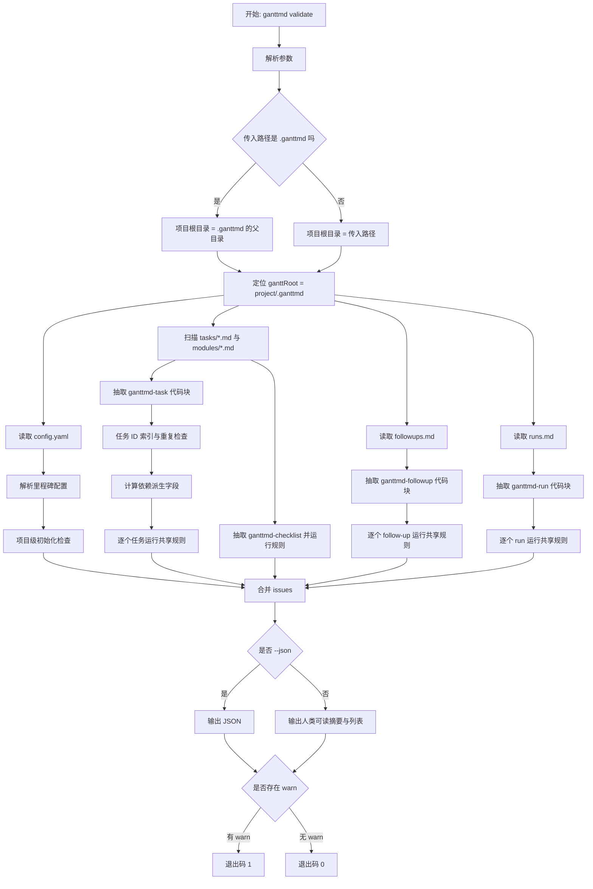
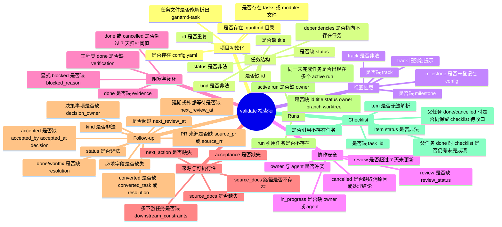

# 校验脚本检查流程图

本文说明 `ganttmd validate` 会读取什么、检查什么，以及最后输出什么。

校验脚本只读 `.ganttmd/` 和被 `source_docs` 引用的路径是否存在，不会修改任何文件。

## 1. 运行入口

在使用方项目根目录运行：

```bash
ganttmd validate
```

如果从其他目录执行，也可以显式传项目路径：

```bash
ganttmd validate /path/to/project
```

也可以直接传 `.ganttmd/` 目录：

```bash
ganttmd validate /path/to/project/.ganttmd
```

如需机器读取结果：

```bash
ganttmd validate --json
```

## 2. 整体流程



## 3. 检查项分类图



## 4. 输出结果

普通输出包含：

```text
GanttMD 校验：<ganttRoot>
任务 <taskCount> 个，follow-up <followupCount> 个，run <runCount> 个，checklist <checklistCount> 个，警告 <warningCount> 个，提示 <infoCount> 个。
- 警告 <id> [<field>] <sourceFile>：<message>
- 提示 <id> [<field>] <sourceFile>：<message>
```

JSON 输出包含：

```json
{
  "root": "/path/to/project",
  "ganttRoot": "/path/to/project/.ganttmd",
  "taskCount": 5,
  "followupCount": 2,
  "runCount": 1,
  "checklistCount": 2,
  "issueCount": 0,
  "warningCount": 0,
  "issues": []
}
```

每条 `issue` 的核心字段：

| 字段 | 含义 |
| --- | --- |
| `level` | `warn` 或 `info` |
| `id` | 任务 ID、follow-up ID，或 `(project)` |
| `message` | 具体问题说明 |
| `sourceFile` | 问题来自哪个 `.ganttmd/` 文件 |
| `field` | 问题对应字段 |

## 5. 退出码规则

| 情况 | 退出码 | 含义 |
| --- | --- | --- |
| 存在 `warn` | `1` | 结构性问题，需要修复或由看板维护者确认 |
| 只有 `info` | `0` | 可运行，但有质量提示 |
| 没有 issue | `0` | 未发现结构问题 |

## 6. 当前不会做的事

- 不会自动修复任务文件。
- 不会自动归档 `done` 或 `cancelled` 任务；看板维护者需要显式补 `archived_at` / `archived_reason`。
- 不会证明 Agent 真的阅读过 `source_docs`。
- 不会校验 PR、commit 或测试命令是否真实存在。
- 不会替代页面视觉检查；它只负责结构性校验。
